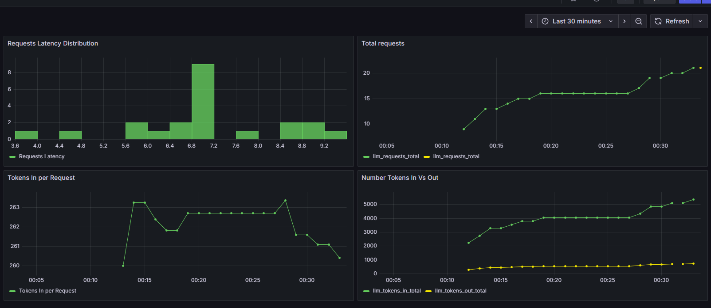

# Diet Assistant – AI-powered Nutrition & Workout Tracker

[](https://diet-assistant-1.onrender.com)

This is a full-stack AI assistant for managing diet, workouts, and motivation, built with:

- **FastAPI** backend
- **React + Vite + Tailwind + ShadCN UI** frontend
- **SQLite** + JSON knowledge base
- **LLMs for reasoning** (via API)
- **Vision model for food recognition**

---

## Features

- User Authentication (JWT)
- Profile Management (age, gender, activity level)
- Chat with AI diet assistant (via Mistral LLM API)
- Upload food images → get nutritional estimates
- Log meals via image or text
- Log workouts via chat
- Daily summaries, motivational insights, and streaks
- Deployed on Render (backend & frontend)

## Live Demo

You can try the Diet Assistant here:  
[**Open Web App**](https://diet-assistant-1.onrender.com)

---

## Stack

| Layer     | Tech                                  |
|-----------|----------------------------------------|
| Frontend  | React + Vite + Tailwind + ShadCN UI    |
| Backend   | FastAPI + SQLAlchemy + JWT             |
| Database  | SQLite + JSON (for knowledge base)     |
| LLM       | Mistral-7B via API                     |
| Vision    | ViT (fine-tuned on Food101)            |
| Deployment| Render (Standard instance + disk)      |

---

## AI Components

### LLM-based Chat
- Powered by **Mistral-7B API**.
- Responds to diet/workout questions, logs food, returns summaries, and motivational advice.
- Uses retrieval-augmented generation (RAG) with a small local JSON knowledge base.

### Vision-based Nutrition Estimation
- Classifies food images using **`nateraw/vit-base-food101`**
- Looks up calories/protein/fat using a custom nutrition JSON dictionary

---

## Critical Notes & Limitations

###  1. Large LLMs are significantly better
- **Mistral-7B API** outperformed all local small models (e.g., TinyLlama, DistilGPT).
- Small models often **repeated the question** or gave **useless output**.

###  2. Running large LLMs locally is not practical
- Mistral-7B requires **high-memory GPU instances** not available on free tiers (e.g., Render).
- Using **LLM APIs** is the best trade-off for quality and cost.

###  3. The vision model is weak
- The `nateraw/vit-base-food101` model:
  - Often returns **generic or incorrect labels**.
  - Accuracy degrades on blurry or real-world user images.
  - Nutrition estimates are based on **static lookups**, not portion size.

###  4. No multi-user real-time sync
- Each user has their own SQLite DB entry.
- Not built for collaboration or real-time updates across devices.

###  5. SQLite is not production-scale
- Works well for a single-user or MVP.
- Needs to be migrated to **PostgreSQL** or similar for scalability.

###  6. Hardcoded token limit
- Backend has no dynamic quota control — Mistral token limits must be enforced manually or via the Mistral dashboard.

###  7. Privacy and security
- No data encryption or privacy-preserving mechanisms implemented.
- Use **HTTPS**, env variable secrets, and secure authentication when going live.

---

## Setup (Local)

### Backend
```bash
cd backend
python -m venv venv
source venv/bin/activate  # or venv\Scripts\activate on Windows
pip install -r requirements.txt
uvicorn main:app --reload
```

### Frontend
```bash
cd frontend
npm install
npm run dev
```

### Environment Variables
Create a `.env` file in `/backend`:
```env
MISTRAL_API_KEY=your_api_key
DB_PATH=/var/data/diet.db  # or use default
```
## Deployment (on Render)
- Backend: Deployed as FastAPI service with persistent disk

- Frontend: Deployed as static site from frontend/ with Tailwind + Vite

## Observability & Monitoring
This project includes **LLM usage monitoring** and **application metrics collection** in both development and production environments.

### Local Development Dashboard

- Uses Prometheus and Grafana locally.

- Metrics exposed by backend at /metrics (FastAPI + Prometheus client).

- Grafana dashboard shows:

    . LLM request count & latency.

    . Tokens in/out per request.

    . Error rates.

### Production Dashboard

- Metrics sent to Grafana Cloud Hosted Prometheus via Prometheus Remote Write.

- Prometheus runs as a Render Web Service and scrapes metrics from the deployed backend.

### Why This Matters
- Proactive monitoring of LLM performance (latency, errors).

- Usage analytics (tokens in/out) for cost management.

- Incident detection (e.g., API downtime, degraded performance).

- Dashboard available in Grafana Cloud for real-time insights.

Here’s an example view of the production LLM monitoring dashboard:



## Future Improvements
- Replace image classification with modern multi-modal models (e.g. Gemini, GPT-4V)

- Migrate from SQLite to PostgreSQL

- Add caching + async tasks for RAG queries

- Add calorie goal tracking, reminders, push notifications

- Mobile PWA version
